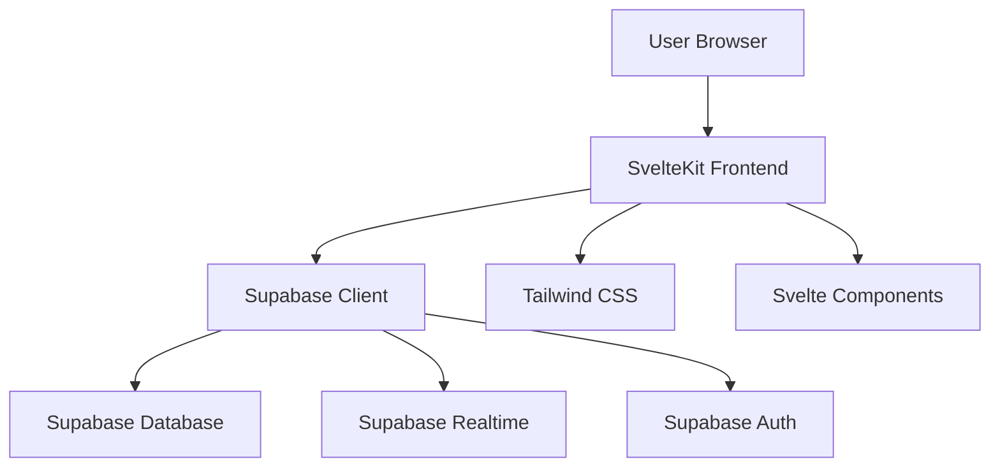

# Design Document

## Overview

The Inventory App is a web-based inventory management application built with modern web technologies. It provides a user-friendly interface for managing inventory items, tracking stock levels, and organizing product data with real-time data handling. The application is optimized for deployment on the Vercel platform and specifically designed to serve small to medium businesses, warehouse managers, and retail operations with a modern, responsive web interface.

## Architecture

### High-Level Architecture



### Frontend Architecture
- **SvelteKit**: Handles routing, SSR/SSG, and application structure
- **Svelte 5**: Reactive components with modern syntax and runes
- **Tailwind CSS**: Utility-first styling with responsive design
- **Component Hierarchy**: Page components → Layout components → UI components

### Backend Architecture
- **Supabase PostgreSQL**: Primary data storage with ACID compliance
- **Row Level Security**: Database-level access control and data isolation
- **Real-time Subscriptions**: Live updates for inventory changes
- **Supabase Client**: JavaScript SDK for database operations and auth

## Components and Interfaces

### Core Components

#### 1. InventoryList Component
- **Purpose**: Display paginated list of inventory items
- **Props**: `items`, `loading`, `onEdit`, `onDelete`
- **Features**: Search, filtering, sorting, low stock highlighting
- **Real-time**: Subscribes to inventory table changes

#### 2. InventoryForm Component
- **Purpose**: Create and edit inventory items
- **Props**: `item` (optional for edit mode), `onSave`, `onCancel`
- **Validation**: Client-side validation with error display
- **Features**: Form state management, loading states

#### 3. SearchAndFilter Component
- **Purpose**: Search and category filtering interface
- **Props**: `onSearch`, `onFilter`, `categories`
- **Features**: Debounced search, category dropdown, clear filters

#### 4. LowStockAlert Component
- **Purpose**: Visual indicators for low stock items
- **Props**: `item`, `threshold`
- **Features**: Color-coded alerts, threshold configuration

### Page Structure

#### `/` - Dashboard/Home Page
- Overview of inventory statistics
- Quick actions (Add Item, View All)
- Low stock alerts summary

#### `/inventory` - Main Inventory Page
- Full inventory list with InventoryList component
- Search and filter functionality
- Add new item button

#### `/inventory/add` - Add Item Page
- InventoryForm component in create mode
- Form validation and submission
- Navigation back to inventory list

#### `/inventory/[id]` - Edit Item Page
- InventoryForm component in edit mode
- Pre-populated with existing item data
- Update and delete actions

## Data Models

### Inventory Item Model

```sql
CREATE TABLE inventory_items (
  id UUID PRIMARY KEY DEFAULT gen_random_uuid(),
  name VARCHAR(255) NOT NULL,
  sku VARCHAR(100) UNIQUE NOT NULL,
  quantity INTEGER NOT NULL DEFAULT 0,
  category VARCHAR(100) NOT NULL,
  low_stock_threshold INTEGER DEFAULT 10,
  description TEXT,
  created_at TIMESTAMP WITH TIME ZONE DEFAULT NOW(),
  updated_at TIMESTAMP WITH TIME ZONE DEFAULT NOW()
);
```

### Category Model

```sql
CREATE TABLE categories (
  id UUID PRIMARY KEY DEFAULT gen_random_uuid(),
  name VARCHAR(100) UNIQUE NOT NULL,
  description TEXT,
  created_at TIMESTAMP WITH TIME ZONE DEFAULT NOW()
);
```

### TypeScript Interfaces

```typescript
interface InventoryItem {
  id: string;
  name: string;
  sku: string;
  quantity: number;
  category: string;
  low_stock_threshold: number;
  description?: string;
  created_at: string;
  updated_at: string;
}

interface Category {
  id: string;
  name: string;
  description?: string;
  created_at: string;
}

interface SearchFilters {
  search: string;
  category: string | null;
  lowStockOnly: boolean;
}
```

## Error Handling

### Client-Side Error Handling
- **Form Validation**: Real-time validation with user-friendly error messages
- **Network Errors**: Retry mechanisms with exponential backoff
- **Loading States**: Skeleton loaders and loading indicators
- **Error Boundaries**: Graceful degradation for component failures

### Database Error Handling
- **Constraint Violations**: Handle unique SKU conflicts with clear messaging
- **Connection Issues**: Offline detection with retry logic
- **Permission Errors**: Clear messaging for unauthorized actions
- **Data Conflicts**: Optimistic updates with conflict resolution

### Error Display Patterns
- **Toast Notifications**: Success and error messages
- **Inline Validation**: Form field-level error display
- **Empty States**: Helpful messages when no data is available
- **Fallback UI**: Alternative content when components fail

## Testing Strategy

### Unit Testing
- **Component Testing**: Test individual Svelte components in isolation
- **Utility Functions**: Test data transformation and validation logic
- **Store Testing**: Test Svelte stores and state management
- **Mock Supabase**: Use mocked Supabase client for unit tests

### Integration Testing
- **Database Operations**: Test CRUD operations with test database
- **Real-time Features**: Test subscription and live update functionality
- **Form Workflows**: Test complete add/edit/delete workflows
- **Search and Filtering**: Test query combinations and edge cases

### End-to-End Testing
- **User Workflows**: Test complete user journeys from start to finish
- **Cross-browser Testing**: Ensure compatibility across modern browsers
- **Responsive Testing**: Verify mobile and desktop experiences
- **Performance Testing**: Test with large datasets and concurrent users

### Testing Tools
- **Vitest**: Unit and integration testing framework
- **Testing Library**: Component testing utilities for Svelte
- **Playwright**: End-to-end testing across browsers
- **Supabase Test Client**: Database testing with isolated test data